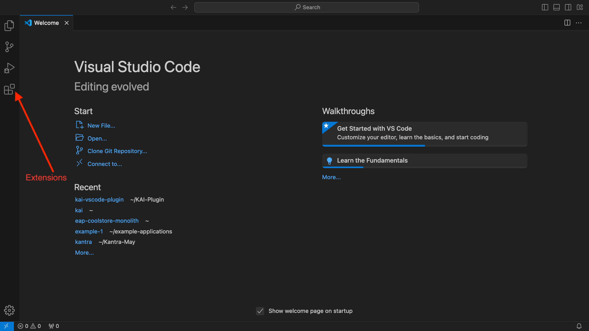
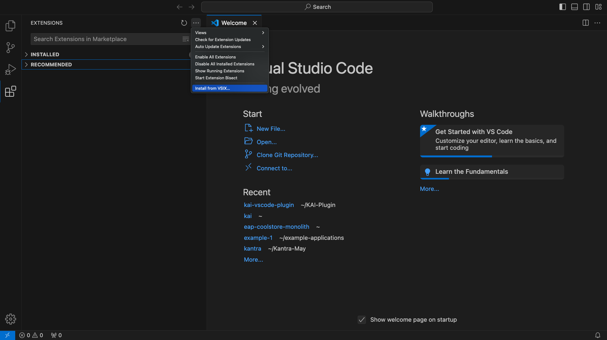
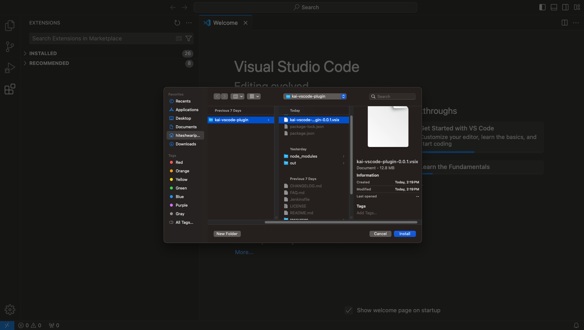
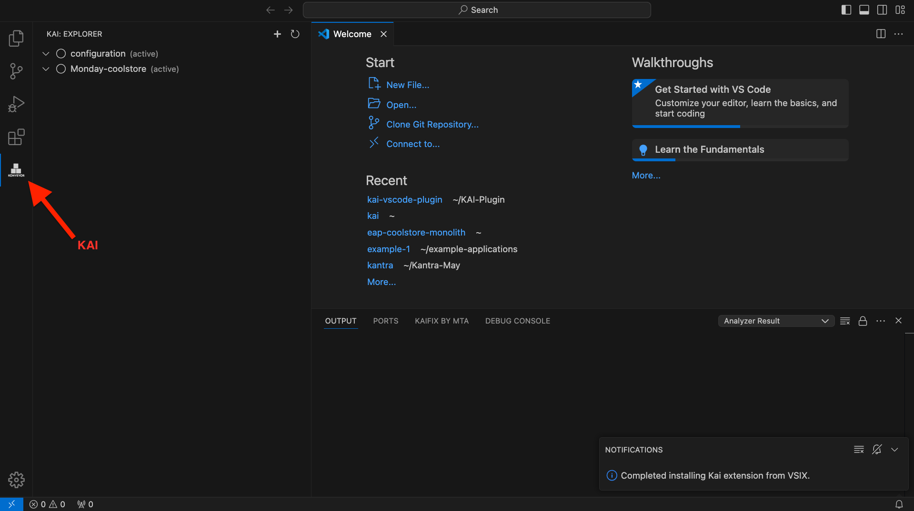
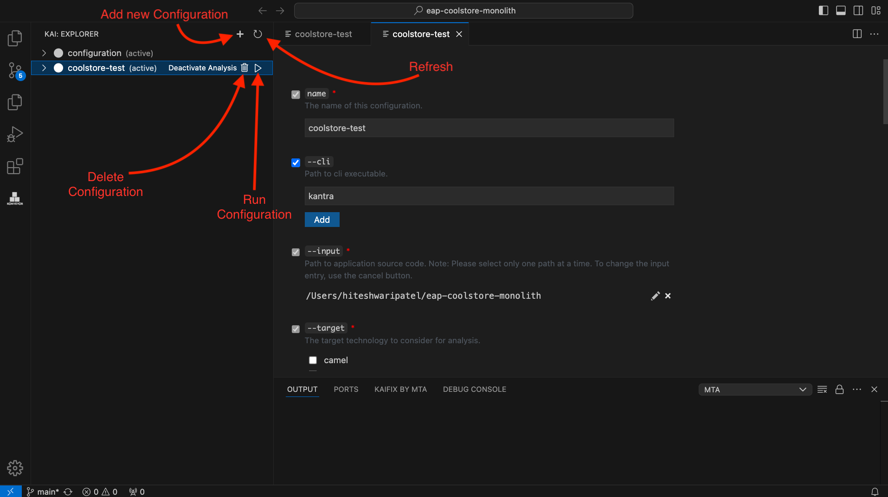
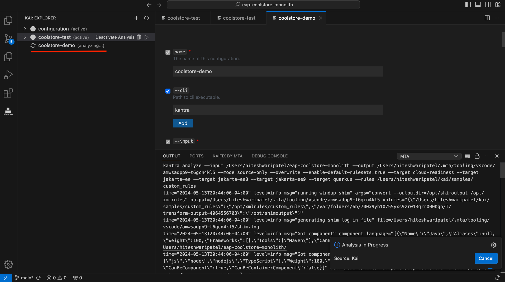
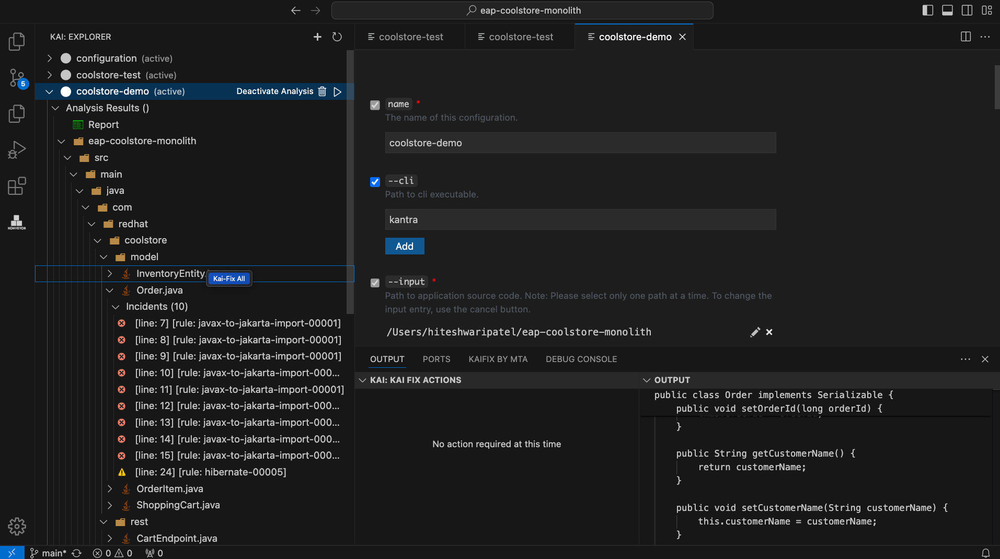
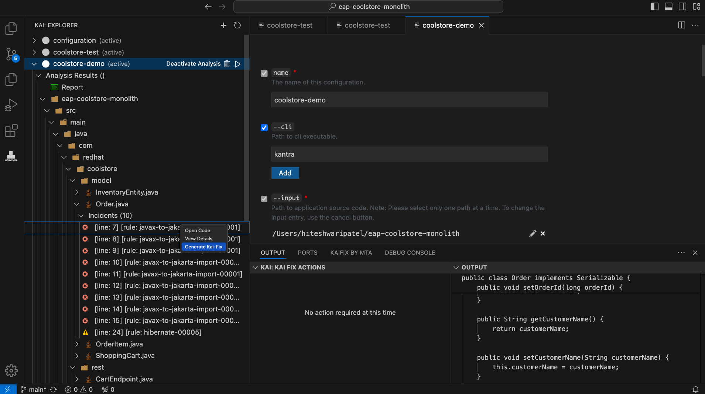
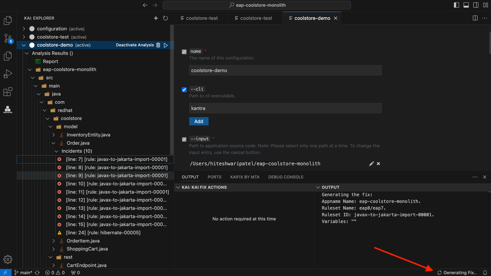
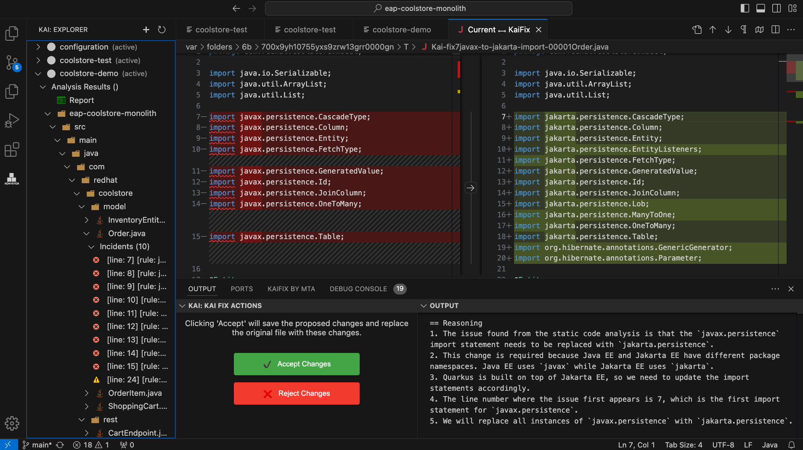

# Installing a VSCode Extension via .vsix File

Download the `.vsix` file [here](https://github.com/konveyor-ecosystem/kai-vscode-plugin/blob/main/kai-vscode-plugin-0.0.1.vsix).

## Installation Methods

### Using VSCode GUI

1. Open Visual Studio Code.
2. Navigate to the Extensions view by clicking on the square icon on the sidebar or by pressing `Ctrl+Shift+X` (Windows/Linux) or `Cmd+Shift+X` (macOS).

3. Click on the `...` (More Actions) button at the top right corner of the Extensions view and select **Install from VSIX...** from the dropdown menu.

4. Locate and select the .vsix file you downloaded and click **Install**.

5. Reload VSCode to activate the extension.


### Using Command Line

1. Install `vsce` by running `npm install -g vsce` in your terminal.
2. Install the .vsix file with the following command:
   ```bash
   code --install-extension path/to/your-extension.vsix 
    ```
3. Restart/reload VSCode.

## Prerequisites(backend)

Follow the instructions to install and setup the following tools and applications:

- [Kantra Installation Guide](https://github.com/konveyor/kantra?tab=readme-ov-file#installation)
- [KAI Installation Guide](https://github.com/konveyor-ecosystem/kai?tab=readme-ov-file#demo-pre-requisites)

# Demo

### Get a Demo App

1. Clone the Cool-store application:
   ```bash
   git clone https://github.com/konveyor-ecosystem/coolstore.git
    ```
2. Navigate to File > Open in VSCode and locate the folder we just cloned.

### Running Kantra Analysis

1. Navigate to the KAI plugin in VSCode.

2. Set the configuration parameters as shown below:
- Input: path to coolstore app
- CLI: `kantra`
- Target: `containerization`, `jakarta-ee`, `jakarta-ee8+`, `jakarta-ee9+`, `quarkus` (if your target is unavailable, click "Add", type your target, and hit enter)
- Rules: Navigate to the path [custom_rules](https://github.com/konveyor-ecosystem/kai/tree/main/samples/custom_rules)
3. Click the `Run` button to start the analysis.
4. Wait for the analysis to complete successfully (expect about 2-3 minutes).



### Running Kai-Fix

1. Ensure your KAI backend is running.
2. To fix all incidents or the file, right-click on the file and select `Kai-Fix All`.

3. To fix a single incident, right-click on the incident and select `Generate Kai-Fix`.

4. After the fix is generated, proposed changes will appear on the right side of the diff editor, while the original file displays on the left.

5. If you find the proposed changes unconvincing, you have the option to revert them by clicking (→).

6. Clicking "Accept Changes" will save the proposed changes and replace the original file. Selecting "Reject Changes" will discard the proposed changes and close the editor.
